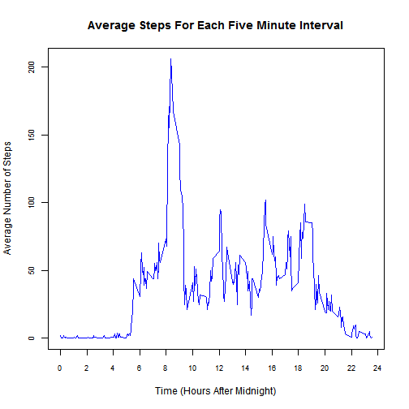
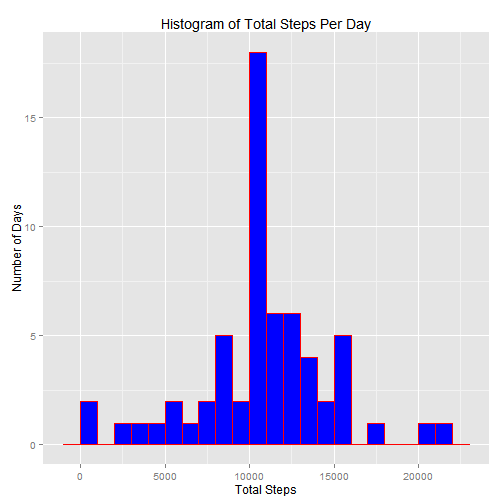
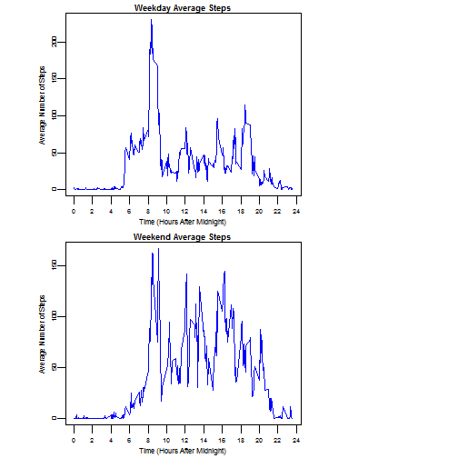

<br><br>

####Part 1: Attach needed libraries and load the data

The "dplyr" package is used to select, group and total the steps per day.

"ggplot2" is used to create some of the plots.

Ensure that these packages are installed.


```r
if(!("dplyr" %in% installed.packages()[ , "Package"]))
{ install.packages("dplyr") }
library(dplyr)
library(ggplot2)
```

It is assumed that the dataset "activity.csv" has already been placed in the working directory.  Read this dataset.


```r
data <- read.csv("activity.csv")
```

<br>

####Part 2: Determine the mean total number of steps taken per day

<br>

#####Step 1: Calculate the total number of steps taken per day


```r
x <- data %>% group_by(date) %>%
              summarize(totSteps = sum(steps))
```
<br>
  
#####Step 2: Make a histogram of the total number of steps taken each day.


```r
qplot(x$totSteps, geom     = 'histogram', 
                  binwidth = 1000, 
                  main     ="Histogram of Total Steps Per Day", 
                  xlab     ="Total Steps", 
                  ylab     ="Number of Days", 
                  fill     =I("blue"), 
                  col      =I("red"))
```

 
<br>

#####Step 3: Calculate and report the mean and median of the total number of steps taken per day


```r
cat(sprintf("Mean of total number of daily steps (missing data excluded): %.2f", 
         mean(x$totSteps, na.rm=TRUE)))
```

```
## Mean of total number of daily steps (missing data excluded): 10766.19
```

```r
cat(sprintf("Median of total number of daily steps (missing data excluded): %.0f",
         median(x$totSteps, na.rm=TRUE)))
```

```
## Median of total number of daily steps (missing data excluded): 10765
```

<br>

####Part 3: Determine the average daily activity pattern

<br>

#####Step 1: Make a time series plot (i.e. type = "l") of the 5-minute interval (x-axis) and the average number of steps taken, averaged across all days (y-axis)


```r
y <- data %>% group_by(interval) %>%
     summarize(avgStepsPerIntvl = round(mean(steps, na.rm=TRUE)))

par(cex.axis=0.75, lab=c(10, 5, 7))
plot(y$interval/100, y$avgStepsPerIntvl,
     type = "l",
     main = "Average Steps For Each Five Minute Interval",
     xlab = "Time (Hours After Midnight)",
     ylab = "Average Number of Steps",
     col = "blue")
```

 

<br>

#####Step 2: Determine which 5-minute interval, on average across all the days in the dataset, contains the maximum number of steps.


```r
cat(sprintf("Time interval which on average contains the max num of steps: %.0f - %.0f",
        y$interval[which.max(y$avgStepsPerIntv)],
        y$interval[min(which.max(y$avgStepsPerIntv)+1, nrow(y))]))
```

```
## Time interval which on average contains the max num of steps: 835 - 840
```

<br>

####Part 4: Impute missing values

<br>

#####Step 1: Calculate and report total number of missing values in the dataset (i.e. total number of rows with NAs)


```r
cat(sprintf("Number of NA's in the step data: %.2f",
        sum(is.na(data$steps))))
```

```
## Number of NA's in the step data: 2304.00
```

<br>

#####Steps 2 and 3: Determine a fill-in strategy and fill in all the missing values of the dataset.
The strategy used is to replace each NA with the mean across all days for that 5 minute interval.  These means were computed and saved in a dataframe in Step 1 of Part 3.


```r
dataNoNA <- data
dataNoNA$ix <- as.integer(dataNoNA$interval / 100) * 12 + 
               dataNoNA$interval %% 100 / 5 + 1
dataNoNA$steps[is.na(dataNoNA$steps)] <- 
               y$avgStepsPerIntvl[dataNoNA$ix[is.na(dataNoNA$steps)]]
```

<br>

#####Step 4a: Make a histogram of the total number of steps taken each day using the dataframe with imputed data.


```r
z <- dataNoNA %>% group_by(date) %>%
     summarize(totSteps = sum(steps))

qplot(z$totSteps, 
      geom     = 'histogram', 
      binwidth = 1000, 
      main     ="Histogram of Total Steps Per Day", 
      xlab     ="Total Steps", 
      ylab     ="Number of Days", 
      fill     =I("blue"), 
      col      =I("red"))
```

 

<br>

#####Step 4b: Calculate and report the mean and median total number of steps taken per day.

```r
cat(sprintf("Mean of total number of daily steps (missing data imputed): %.2f", 
        mean(z$totSteps)))
```

```
## Mean of total number of daily steps (missing data imputed): 10765.64
```

```r
cat(sprintf("Median of total number of daily steps (missing data imputed): %.0f",
        median(z$totSteps)))
```

```
## Median of total number of daily steps (missing data imputed): 10762
```

The mean and median do not differ by much from the first part of the assignment,
which is not surprising since each missing value was replaced with the mean for that time interval.

Eight days of data are missing in the dataset, and replacement of the eight days of data
with the mean of each time interval of the other days results in the day count 
at the center of the histogram increasing by 8 days from 10 to 18.

<br>

####Part 5: Differences in activity patterns between weekdays and weekends

<br>

#####Step 1: Using the dataset with filled in missing values, create a new factor variable in the dataset indicating whether a day is a weekday or a weekend.


```r
temp <- rep("weekday", times = nrow(dataNoNA))
temp[weekdays(as.Date(dataNoNA$date)) == "Saturday" | 
     weekdays(as.Date(dataNoNA$date)) == "Sunday"] = "weekend"
dataNoNA$typeOfDay <- as.factor(temp)
```

<br>

#####Step 2: Make a panel plot


```r
par(cex.axis=0.6, 
    cex.main=0.75, 
    cex.lab=0.65, 
    lab=c(9, 5, 7), 
    mar=c(2.5,5,1,12),
    mfrow=c(2,1),
    mgp = c(3, 0.5, 0),
    tck=-0.04)
wday <- dataNoNA[dataNoNA$typeOfDay == "weekday",] %>% 
        group_by(interval) %>%
        summarize(avgStepsPerIntvl = mean(steps))
plot(wday$interval/100, wday$avgStepsPerIntvl,
     type = "l",
     main = "Weekday Average Steps",
     xlab = "",
     ylab = "",
     col = "blue")
title(xlab="Time (Hours After Midnight)", line=1.3)
title(ylab="Average Number of Steps", line=1.4)

wend <- dataNoNA[dataNoNA$typeOfDay == "weekend",] %>% 
  group_by(interval) %>%
  summarize(avgStepsPerIntvl = mean(steps))
plot(wend$interval/100, wend$avgStepsPerIntvl,
     type = "l",
     main = "Weekend Average Steps",
     xlab = "",
     ylab = "",
     col = "blue")
title(xlab="Time (Hours After Midnight)", line=1.3)
title(ylab="Average Number of Steps", line=1.4)
```

 
